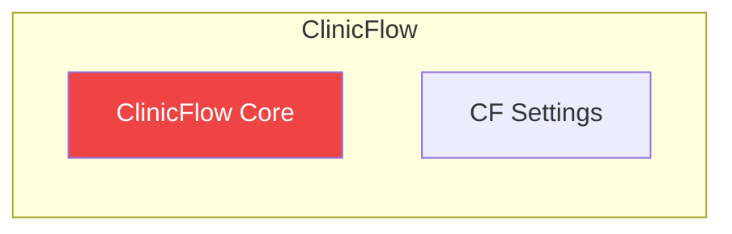

# ClinicFlow — Module Map
# كلينك فلو — خريطة الوحدات

```mermaid
graph LR
    subgraph ClinicFlow
        Core["ClinicFlow Core"]
        Settings["CF Settings"]
    end
    style Core fill:#EF4444,color:#fff
```

> **Note:** This is a placeholder module map. Update with actual modules from `modules.txt`.
